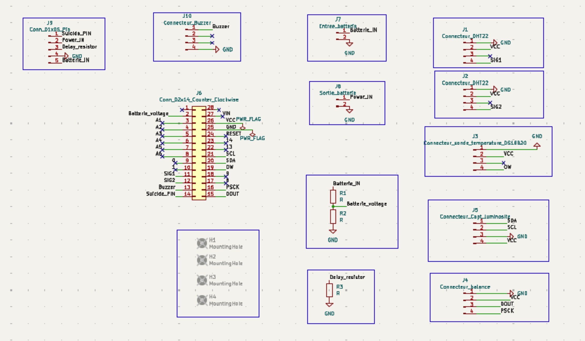

# Guide du Projet Ruche Connectée

## Présentation du projet

Le projet Ruche Connectée, une initiative du programme EI 4ème année à Polytech Sorbonne, illustre l’intégration fluide de la technologie à la surveillance environnementale. Ce projet a pour objectif de développer un système avancé d’Internet des Objets (IoT) pour la surveillance en temps réel des ruches. Il innove dans le domaine de l’apiculture en permettant une collecte et une analyse de données précises, tout en établissant une nouvelle norme d’exploitation des données collectées.

Une fois collectées, les données sont soigneusement analysées et interprétées. Cela implique la transformation des données brutes des capteurs en informations utiles permettant une compréhension globale de l’état des ruches. Ces informations sont ensuite accessibles aux apiculteurs et chercheurs via l’interface de programmation Beep (API), facilitant ainsi une gestion proactive et éclairée des colonies d’abeilles.

Au-delà de ses applications pratiques, Ruche Connectée représente une avancée technologique dans l’interaction entre l’IoT et l’apiculture. Il ne s’agit pas seulement de collecter des données, mais de les interpréter pour ouvrir de nouvelles perspectives dans l’élevage des abeilles : conditions de ruche optimales, prévention des maladies, etc. En alliant technologies de pointe et connaissances en sciences de l’environnement, Ruche Connectée initie une nouvelle ère d’apiculture intelligente, en harmonie avec la nature.

### Mission et objectifs

La mission d’Ruche Connectée est de proposer une solution de pointe, fiable et en temps réel pour la surveillance des ruches, répondant aux besoins pressants des apiculteurs et chercheurs. Dans un contexte de défis environnementaux affectant les populations d’abeilles, Ruche Connectée devient un allié crucial. En surveillant des paramètres essentiels comme la température, l’humidité, le poids de la ruche et l’exposition à la lumière, le projet ne se contente pas de fournir des données : il ouvre une fenêtre sur la vie et la santé des colonies, contribuant ainsi à la sécurité alimentaire mondiale et à la préservation de la biodiversité.

### Approche technique

Au cœur d’Ruche Connectée se trouve un engagement envers la précision et la fiabilité. Grâce aux dernières technologies IoT, le projet garantit une collecte de données précises sur les conditions des ruches, rapidement transmises. Grâce à la synergie de capteurs sélectionnés avec soin et d’une infrastructure de communication robuste (LoRaWAN), Ruche Connectée assure aux apiculteurs et chercheurs des informations exploitables et en temps voulu, favorisant des décisions éclairées.

## Détails du matériel

### 1. Carte MKRWAN
- Élément central du système, la carte MKRWAN 1310 compatible Arduino est conçue pour la communication LoRaWAN. Son design est optimisé pour les applications IoT avec une consommation réduite, essentielle pour une surveillance discrète et efficace des ruches.

### 2. Capteurs de température et d’humidité DHT22
- Choisis pour leur précision, les capteurs DHT22 mesurent avec fiabilité température et humidité à l’intérieur de la ruche, fournissant des données critiques pour le suivi de la santé des abeilles.

### 3. Capteurs de température DS18B20
- Utilisés pour mesurer les conditions externes, les capteurs DS18B20 utilisent le protocole OneWire reconnu pour son efficacité, facilitant une intégration simple et fiable.

### 4. Cellule de charge H401-C3 et amplificateur HX711
- Essentiels à la surveillance du poids de la ruche, la cellule de charge H401-C3 et l’amplificateur HX711 offrent des mesures précises grâce à une conversion analogique-numérique à faible bruit.

### 5. Capteur de luminosité DfRobot SEN0562
- Ce capteur mesure la lumière ambiante autour de la ruche. Il fournit un contexte précieux sur l’environnement extérieur et permet de surveiller l’ensoleillement pour le bon fonctionnement du panneau solaire.

### 6. Buzzer
- Le buzzer ajoute un retour auditif au système. Il est utilisé pour les diagnostics, l’indication de connexion et pour alerter l’apiculteur de certains états de la ruche.

### 7. Alimentation (batterie LiPo, panneaux solaires et module TPL5110)
- Une batterie LiPo rechargeable alimente le système, assurant son autonomie.
- Le module de gestion d’énergie TPL5110 est utilisé pour optimiser la consommation, ne mettant le système en fonctionnement que lorsque nécessaire.

### Considérations d’alimentation

#### Intégration Batterie LiPo et Panneaux Solaires

##### 1. Batterie LiPo
- Batterie LiPo rechargeable, tension nominale 3,7V (max ~4,2V), capacité 1050 mAh.

##### 2. BMS LiPo Rider Pro
- Gère efficacement la charge de la batterie à partir des panneaux solaires, avec protection contre surcharge et décharge excessive.

##### 3. Panneaux Solaires
- Dimensions : environ 18cm x 8cm. Rechargent la batterie pendant la journée.

##### 4. Consommation Électrique
- Composants basse consommation, modes de veille, TPL5110 pour la mise en sommeil automatique entre les transmissions.

### Schéma de circuit imprimé (PCB)
- Le PCB intègre tous les composants matériels avec des connecteurs dédiés (MKRWAN, capteurs, TPL5110), assurant une communication fluide et une alimentation efficace.

#### Caractéristiques clés :
- **Interface MKRWAN 1310**  
- **Connecteurs de capteurs** via connecteurs Grove  
- **Intégration TPL5110** pour la gestion de l’alimentation



## Montage matériel

Connexion des capteurs au PCB :

- **Carte MKRWAN** : Connecter l’alimentation et configurer pour le LoRaWAN.
- **Capteurs internes (DHT22 + DS18B20)** : `j2` et `j3`.
- **Capteur externe (DHT22)** : `j1`.
- **Cellule de charge** : Connecter au HX711, puis à `j4`.
- **Capteur de luminosité** : `j5`.
- **Buzzer** : `Connecteur_buzzer`.
- **Batterie** : `Battery_IN`, alimentation via le TPL5110 (connecteur `j9`), sortie vers Arduino via `Battery_OUT`.
- **Diviseur de tension** : résistances `R1` et `R2`, ratio : `R2 = 2*R1`, valeurs min. 10kΩ.

## Logiciels requis

### 1. Arduino IDE
- Utilisé pour la programmation de la carte MKRWAN.

### 2. Connexion LoRaWAN
- Configurer une connexion avec un fournisseur comme TTN (The Things Network).

## Instructions d'installation

### 1. Montage matériel
- Suivre le schéma de câblage.

### 2. Configuration de l'IDE Arduino
- Installer les bibliothèques : `DHT22`, `OneWire`, `HX711`.

### 3. Configuration LoRaWAN
- Récupérer `AppEui` et `AppKey` depuis TTN.
- Les insérer dans le code Arduino.

### 4. Calibration du capteur de poids

**Étapes :**

1. Choisir un poids de référence connu (ex : 1095 g).
2. Le placer sur la ruche.
3. Relever la valeur brute du capteur.
4. Calculer :  
   `Facteur = Poids de référence / Valeur brute`
5. Appliquer ce facteur dans le code (`SCALE_CALIB`, `CALIB_OFFSET`).

## Implémentation logicielle

### Configuration de l’environnement

1. **Installer Arduino IDE** : [arduino.cc](https://www.arduino.cc/en/software)
2. **Configurer la carte MKRWAN** : dans `Outils > Type de carte > Gestionnaire de cartes`
3. **Installer les bibliothèques** :
   - `MKRWAN`, `DHT sensor library`, `OneWire`, `HX711`

### Cloner le code source

```sh
     git clone https://github.com/luckymoy/Open-Ruche
```

### Téléversement du code sur la carte MKRWAN

1. **Ouvrir le projet dans l’IDE Arduino**  
   - Lancez l’IDE Arduino.  
   - Allez dans `Fichier > Ouvrir`.  
   - Naviguez jusqu’au dossier `Open-Ruche` cloné précédemment.  
   - Ouvrez le fichier `open_ruche.ino`.

2. **Connecter la carte MKRWAN à votre ordinateur**  
   - Branchez la carte à l’aide d’un câble USB adapté.  
   - Si c’est la première fois que vous connectez la carte, attendez l’installation automatique des pilotes.

3. **Sélectionner la bonne carte et le bon port**  
   - Dans l’IDE, allez dans `Outils > Type de carte` et sélectionnez `Arduino MKRWAN 1310`.  
   - Dans `Outils > Port`, choisissez le port série correspondant à votre carte (ex : `COM4` ou `/dev/ttyACM0`).

4. **Téléverser le code**  
   - Cliquez sur le bouton `Téléverser` (icône flèche droite).  
   - Attendez la fin de la compilation et du transfert.  
   - Le message `Téléversement terminé` confirmera le succès.

---

## Tests

### 1. Surveillance des données

- Surveillez les données transmises via LoRaWAN depuis la console de votre fournisseur (ex. : TTN Console).
- **N’oubliez pas** de **décommenter** la constante `DEBUG_SERIAL` au début du code pour afficher les données via le port série.
- Vérifiez les mesures suivantes :
  - Température intérieure et extérieure
  - Humidité intérieure et extérieure
  - Poids de la ruche
  - Luminosité
  - Tension de la batterie

---

## Programmation

Le projet Ruche Connectée fonctionne grâce à une carte Arduino MKRWAN 1310 et à un code spécifique intégrant plusieurs bibliothèques. Ci-dessous, un aperçu de la structure du code et des fonctions principales.

### Structure du code

Le fichier principal `open_ruche.ino` est organisé en sections :

- **Initialisation du matériel** : configuration des broches, capteurs et modules.
- **Mesures capteurs** : fonctions dédiées pour HX711, DHT22, DS18B20, capteur de luminosité.
- **Surveillance batterie** : lecture de la tension via l’entrée analogique.
- **Communication LoRa** : formatage des données (CSV) et envoi via LoRa.
- **Gestion de l’énergie** : mode basse consommation avec extinction automatique.
- **Débogage** : affichage des mesures si `DEBUG_SERIAL` est activé.

---

## Bibliothèques utilisées

Les bibliothèques suivantes doivent être installées dans l’IDE Arduino :

- `MKRWAN` – pour la communication LoRaWAN.
- `DHT sensor library` – pour capteurs DHT22.
- `OneWire` – pour les capteurs DS18B20.
- `HX711` – pour la cellule de charge.

---

## Transmission et visualisation des données

Le système Ruche Connectée transmet les données collectées vers la plateforme Beep via The Things Network (TTN), offrant ainsi une visualisation complète et une analyse des conditions de la ruche.

### Étapes d'envoi des données vers Beep depuis TTN

1. **Formatage du payload dans TTN**  
   - Les données transmises par la carte MKRWAN arrivent dans TTN sous forme binaire brute.  
   - Un `Payload Formatter` est utilisé pour convertir ces données en un format structuré exploitable par l’API Beep.  
   - Le formatter est un script JavaScript exécuté directement dans la console TTN.

2. **Exemple de Payload Formatter**  
   - Voici un exemple de script de décodage utilisé dans le projet Ruche Connectée :

     ```javascript
     function decodeUplink(input) {
       // Convertir le payload en chaîne de caractères
       let payload = String.fromCharCode.apply(null, input.bytes);
       
       // Découper les valeurs séparées par des virgules
       let values = payload.split(',');

       // Extraire et convertir les données
       return {
         data: {
           key: "** secret key here **",
           weight_kg: parseFloat(values[0]),
           bv: parseFloat(values[1]),
           t: parseFloat(values[2]),
           h: parseFloat(values[3]),
           t_i: parseFloat(values[4]),
           h_i: parseFloat(values[5]),
           t_0: parseFloat(values[6]),
           l: parseFloat(values[7])
         },
         warnings: [],
         errors: []
       };
     }
     ```

   - Ce script décode les valeurs de température, humidité, poids, luminosité et tension batterie.  
   - Importez ce script dans l’onglet **Payload Formatters** de la console TTN.

3. **Envoi des données vers Beep**  
   - Une fois le payload décodé, TTN envoie les données vers Beep via un **webhook**.  
   - L’URL du webhook est de la forme suivante :  
     ```
     https://beep-test.azurewebsites.net/api/yann
     ```
   - Les données doivent respecter le format attendu par l’API Beep.

4. **Clés de données Beep API**  
   - L’API Beep attend des clés spécifiques (ex. : `weight_kg`, `t_i`, `h_i`, etc.).  
   - Assurez-vous que les noms de variables dans le formatter correspondent à ceux définis dans l’interface Beep.  
   - Vous pouvez retrouver les clés spécifiques à votre ruche ou balance sur Beep via l’onglet **Données > Modifier les dispositifs**.

---

## Remerciements

Ce projet est le fruit d’un travail collaboratif réalisé par les étudiants de Polytech Sorbonne :

- **Ugo Lucchi**  
- **Pierre Bataille**  
- **Karlitou-Formance Mendy**

---

## Contact

Pour toute information complémentaire ou question, vous pouvez nous contacter à l’adresse suivante :  
📧 *(ajouter votre adresse email ici si besoin)*
